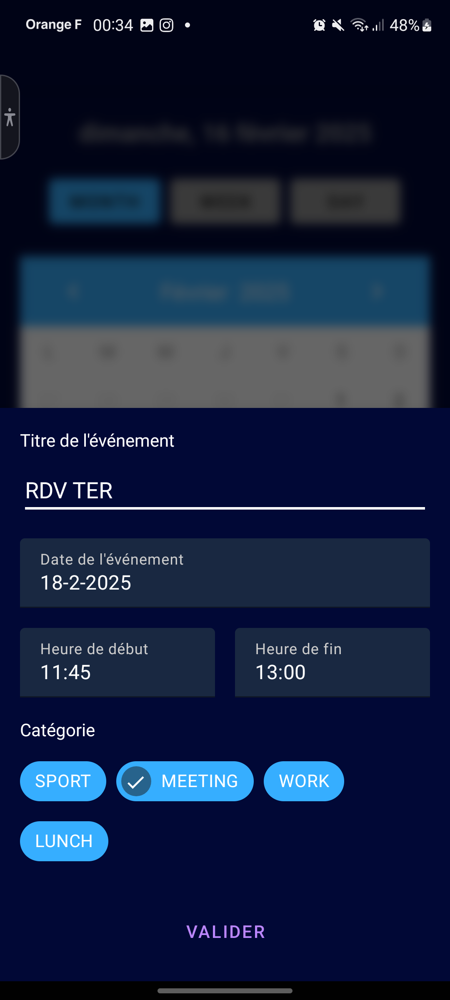

# AgendaApp

## Introduction

### Setup de l'application

#### Avec android studio:

1. Clonez le dépôt :
   ```bash
   git clone [URL du dépôt]
   ```
2. Ouvrez Android Studio et sélectionnez "Open an existing project".
3. Naviguez jusqu'au répertoire du projet cloné et ouvrez-le.
4. Laissez Android Studio télécharger les dépendances et configurer le projet.
5. Une fois la configuration terminée, cliquez sur "Run" pour exécuter l'application sur un émulateur ou un appareil physique.

#### Sans android studio:

1. Clonez le dépôt : `git clone [URL du dépôt]`
2. Accédez au répertoire du projet : `cd AgendaApp`
3. Installez les dépendances : `./gradlew build`
4. Lancez l'application : `./gradlew run`

### But de l'application
L'application Agenda permet de gérer un calendrier avec la possibilité d'ajouter des événements selon la catégorie, la date, l'heure, et le nom. En cliquant sur un jour spécifique, une liste des événements de ce jour s'affiche.

## Présentation de l'UI
Voici quelques captures d'écran de l'interface utilisateur :

### Écran d'accueil

Ecran d'acceuil avec la date du jour, le calendrier avec des icônes pour les jours comportant des événements, trois boutons pour les différentes vues et un bouton d'ajout d'événement.

  

### Ajout d'un événement

Ajouter un événement avec un nom, une date, une heure de début et de fin est une catégorie parmis celles proposées.

  
  

### Update de l'affichage du calendrier

L'évènement est ajouté au calendrier en fermant la bottomsheet d'ajout. Un icône et une couleur sont associés au jour selon la catégorie de l'événement, ici, bleu pour MEETING. Avec plusieurs événements, l'iône et la couleur sont ceux du premier événement ajouté.


### Liste des événements

Consultation des différents évènements en cliquant sur un jour en particulier. L'évènement affiche le titre, l'heure de début et de fin ainsi que la couleur de la catégorie associée.
Malgrès mes nombreuses tentatives, impossible de garder le fond de la page transparent ce qui aurait été beaucoup plus esthétique.

  
  

## Explication du Backend

### Bottom Sheets
- `AddEventBottomSheet.kt` : Gère l'ajout d'événements avec des champs pour le titre, la date, l'heure de début, l'heure de fin, et la catégorie. Utilise des composants Material Design comme `MaterialDatePicker` et `MaterialTimePicker`.

### MainActivity
- `MainActivity.kt` : Gère l'affichage du calendrier, l'ajout d'événements, et l'affichage des événements pour une date sélectionnée. Utilise `CalendarView` pour afficher le calendrier et `FloatingActionButton` pour ajouter des événements.

### EventAdapter
- `EventAdapter.kt` : Adapte les événements pour les afficher dans une `RecyclerView`. Chaque événement est affiché avec son titre, son heure de début, son heure de fin, et une couleur correspondant à sa catégorie.

### EventCategory
- `EventCategory.kt` : Définit les catégories d'événements avec des icônes et des couleurs associées. Les catégories incluent SPORT, MEETING, WORK, et LUNCH.

## Points à améliorer dans le futur
- ajout rapide mais pas fait par oubli: une description pour chaque événement
- Ajouter des notifications pour les événements.
- Intégrer une fonctionnalité de synchronisation avec un calendrier en ligne.
- Améliorer l'interface utilisateur pour une meilleure expérience utilisateur.

